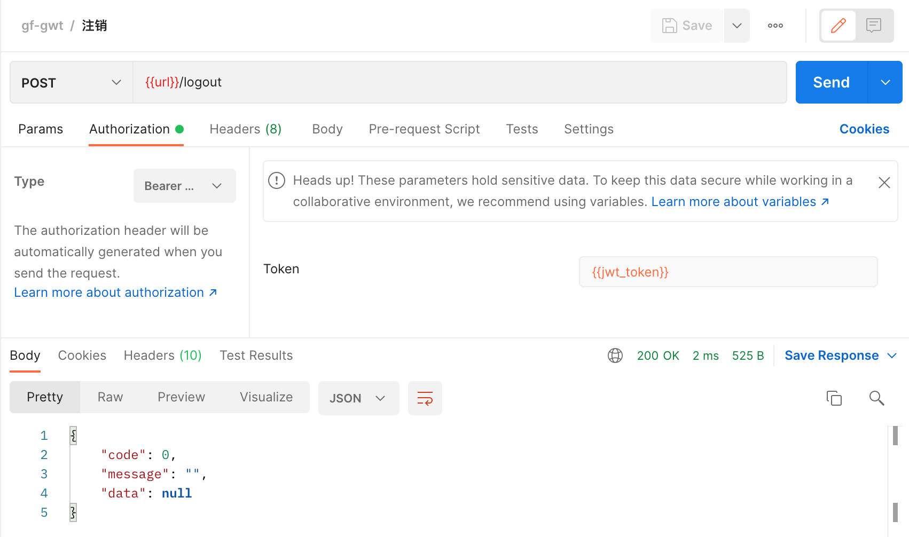
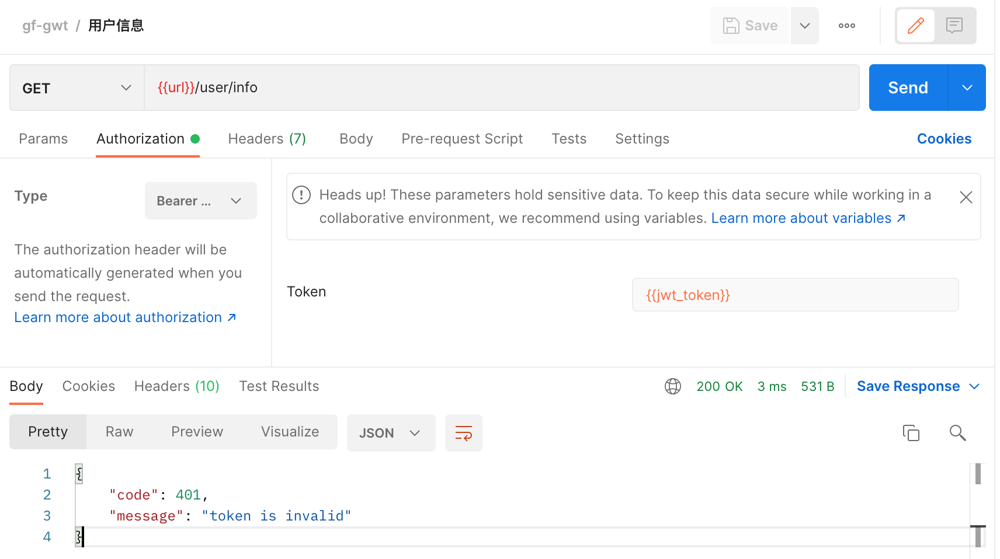

# gf-jwt v2

This is a middleware for Gf framework.

It uses jwt-go to provide a jwt authentication middleware. It provides additional handler functions to provide the login api that will generate the token and an additional refresh handler that can be used to refresh tokens.

## Use

Download and install

```sh
$ go get github.com/gogf/gf-jwt/v2
```

Import

```go
import "github.com/gogf/gf-jwt/v2"
```





