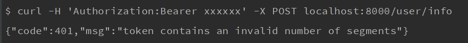

# gf-jwt
GF jwt plugin

This plugin is forked [https://github.com/appleboy/gin-jwt](https://github.com/appleboy/gin-jwt) plugin, modified to [https://github.com/gogf/gf](https://github.com/gogf/gf) plugin.


[英文](README.md) [中文](README_zh.md)


## Use

Download and install

```sh
$ go get github.com/gogf/gf-jwt
```

Import

```go
import "github.com/gogf/gf-jwt"
```

## Example

Check demo [example/auth/auth.go](example/auth/auth.go) and use `ExtractClaims` to customize user data.

[embedmd]:# (example/auth/auth.go go)


## Demo

Run `example/server/server.go` on the `8000` port.

```bash
$ go run example/server/server.go
```


Test the effect on the command line via [httpie](https://github.com/jkbrzt/httpie).

### Login interface:

```bash
$ http -v --form POST localhost:8000/login username=admin password=admin
```

Command line output


### Refresh token interface:

```bash
$ http -v -f GET localhost:8000/user/refresh_token "Authorization:Bearer xxxxxxxxx" "Content-Type: application/json"
```

Command line output


### hello interface

We test the return of the hello interface with the username `admin` and password `admin`

```bash
$ http -f GET localhost:8000/user/hello "Authorization:Bearer xxxxxxxxx" "Content-Type: application/json"
```

Command line output


### User Authentication Interface

We use an unauthorized token to test the return of the hello interface.

```bash
$ http -f GET localhost:8000/user/hello "Authorization:Bearer xxxxxxxxx" "Content-Type: application/json"
```

Command line output




Thanks again [https://github.com/appleboy/gin-jwt](https://github.com/appleboy/gin-jwt)