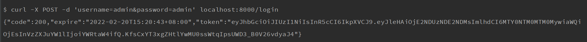
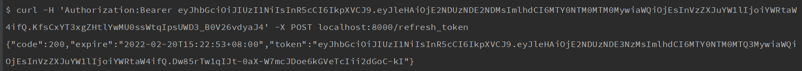

# gf-jwt
gf 的 jwt 插件

这个插件是 fork 了 [https://github.com/appleboy/gin-jwt](https://github.com/appleboy/gin-jwt) 插件,修改为 [https://github.com/gogf/gf](https://github.com/gogf/gf) 插件. 


[英文](README.md) [中文](README_zh.md)


## 使用

下载安装

```sh
$ go get github.com/zhaopengme/gf-jwt
```

导入

```go
import "github.com/zhaopengme/gf-jwt"
```

## 例子

查看 [demo](example/auth/index.go) ,使用 `ExtractClaims` 可以自定义用户数据.

[embedmd]:# (example/auth/index.go go)

```go
package auth

import (
	"github.com/gogf/gf/g"
	"github.com/gogf/gf/g/net/ghttp"
	"github.com/gogf/gf/g/util/gvalid"
	"github.com/zhaopengme/gf-jwt"
	"log"
	"net/http"
	"time"
)

type Default struct {
	GinJWTMiddleware *jwt.GinJWTMiddleware
	Rules            map[string]string
}

func (d *Default) Init() {
	authMiddleware, err := jwt.New(&jwt.GinJWTMiddleware{
		Realm:           "test zone",
		Key:             []byte("secret key"),
		Timeout:         time.Minute * 5,
		MaxRefresh:      time.Minute * 5,
		IdentityKey:     "id",
		TokenLookup:     "header: Authorization, query: token, cookie: jwt",
		TokenHeadName:   "Bearer",
		TimeFunc:        time.Now,
		Authenticator:   d.Authenticator,
		LoginResponse:   d.LoginResponse,
		RefreshResponse: d.RefreshResponse,
		Unauthorized:    d.Unauthorized,
		IdentityHandler: d.IdentityHandler,
		PayloadFunc:     d.PayloadFunc,
	})
	if err != nil {
		log.Fatal("JWT Error:" + err.Error())
	}
	d.GinJWTMiddleware = authMiddleware
	d.Rules = map[string]string{
		"username": "required",
		"password": "required",
	}
}

func (d *Default) PayloadFunc(data interface{}) jwt.MapClaims {
	claims := jwt.MapClaims{}
	params := data.(map[string]interface{})
	if len(params) > 0 {
		for k, v := range params {
			claims[k] = v
		}
	}
	return claims
}

func (d *Default) IdentityHandler(r *ghttp.Request) interface{} {
	claims := jwt.ExtractClaims(r)
	return claims["id"]
}

func (d *Default) Unauthorized(r *ghttp.Request, code int, message string) {
	r.Response.WriteJson(g.Map{
		"code": code,
		"msg":  message,
	})
	r.ExitAll()
}

func (d *Default) LoginResponse(r *ghttp.Request, code int, token string, expire time.Time) {
	r.Response.WriteJson(g.Map{
		"code":   http.StatusOK,
		"token":  token,
		"expire": expire.Format(time.RFC3339),
	})
	r.ExitAll()
}

func (d *Default) RefreshResponse(r *ghttp.Request, code int, token string, expire time.Time) {
	r.Response.WriteJson(g.Map{
		"code":   http.StatusOK,
		"token":  token,
		"expire": expire.Format(time.RFC3339),
	})
	r.ExitAll()
}

func (d *Default) Authenticator(r *ghttp.Request) (interface{}, error) {
	data := r.GetMap()
	if e := gvalid.CheckMap(data, d.Rules); e != nil {
		return "", jwt.ErrFailedAuthentication
	}
	if (data["username"] == "admin" && data["password"] == "admin") {
		return g.Map{
			"username": data["username"],
			"id":       data["username"],
		}, nil
	}

	return nil, jwt.ErrFailedAuthentication
}

```

## Demo

运行 `example/server/index.go` 在 `8000`端口.

```bash
$ go run example/server/index.go
```


通过 [httpie](https://github.com/jkbrzt/httpie) ,在命令行来测试下效果.

### 登录接口:

```bash
$ http -v --form  POST localhost:8000/login username=admin password=admin
```

命令行输出



### 刷新 token 接口:

```bash
$ http -v -f GET localhost:8000/user/refresh_token "Authorization:Bearer xxxxxxxxx"  "Content-Type: application/json"
```

命令行输出



### hello 接口

我们使用用户名 `admin` 和密码 `admin` 测试一下 hello 接口的返回

```bash
$ http -f GET localhost:8000/user/hello "Authorization:Bearer xxxxxxxxx"  "Content-Type: application/json"
```

命令行输出


### 用户验证接口

我们用未授权的 token 来测试 hello 接口的返回

```bash
$ http -f GET localhost:8000/user/hello "Authorization:Bearer xxxxxxxxx"  "Content-Type: application/json"
```

命令行输出


再次感谢[https://github.com/appleboy/gin-jwt](https://github.com/appleboy/gin-jwt)